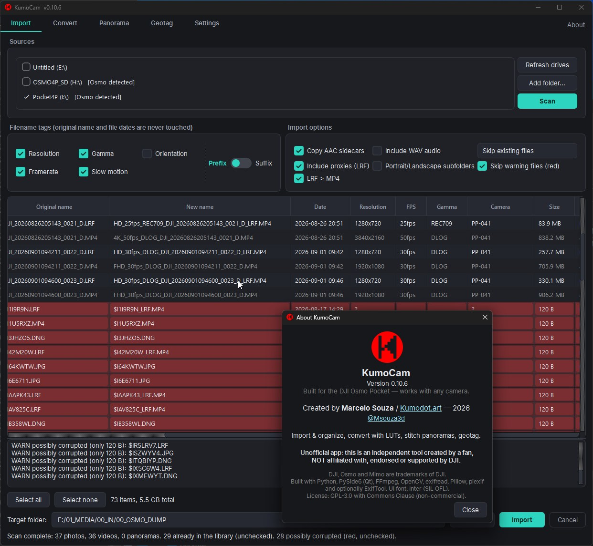

# KumoCam

  

The camera import companion — built for the **DJI Osmo Pocket 4 / 4P**,
works with any camera through camera profiles. Windows (primary) and macOS (secondary).
Created by **Marcelo Souza / [Kumodot.art](https://kumodot.art)** — 2026 //
[@Msouza3d](https://www.instagram.com/msouza3d/). Credits are in the app's About button.

> **Unofficial app**: this is an independent tool created by a fan, not
> affiliated with, endorsed or supported by DJI. DJI, Osmo and Mimo are
> trademarks of DJI.

## Features

### Import
- Auto-detects camera drives (internal + SD card)
- Organizes into date folders (PHOTOS / VIDEOS / PANORAMA)
- Metadata renaming tags: resolution, fps, gamma (DLOG/REC709), SLOWxxx, orientation — prefix or suffix
- Original filenames and dates always preserved
- Camera auto-detection per file (DJI Osmo, Lumix, iPhone, generic) with Camera column
- Duplicate detection against your library (rename-proof)
- Flags corrupted files (red) and huge videos (orange), with auto-skip option
- JPG+DNG pairs and AAC sidecars handled together
- Optional LRF proxy import, with LRF > MP4 rename
- Remembers last/default target folder

### Convert
- Batch 4K → 1080p/720p, H.264/H.265, quality presets
- Auto D-Log → Rec.709 LUT (only on clips that are actually D-Log)
- Per-clip audio removal + bulk mute/unmute
- Merge clips into one video
- Inline video thumbnails
- Vertical-video safe scaling, timestamps preserved

### Panorama
- Stitches raw SD card segments (3x3 and 180°) — no PTGui needed
- Auto projection (spherical/cylindrical), horizon leveling, seam blending
- Camera profile dropdown; warns when DJI Mimo would do better (3x3)

### Geotag
- Batch GPS writing from a map click, reference photo, or pasted coordinates
- Works on JPG natively; DNG/MP4 via ExifTool
- File dates untouched

### General
- Dark/light theme, custom UI, bundled Inter font
- Camera profiles as editable JSON — add your own camera
- Configurable table columns
- Windows + macOS, free (GPL-3.0 + Commons Clause)

## Requirements

- Python 3.10+
- FFmpeg (`ffprobe`/`ffmpeg` in PATH, or in a `bin/` folder next to this
  README). Without it, photos still work but video features are unavailable.
- Optional: ExifTool, for writing GPS into DNG/MP4 files.
- LUT files: download the official `.cube` for your camera from the maker's
  site (e.g. [dji.com/lut](https://www.dji.com/lut)) — they cannot be
  bundled or redistributed with this app.

## Run

- **Windows:** double-click `run_windows.bat` (creates a local `.venv` on
  first run and keeps dependencies in sync on every launch).
- **macOS/Linux:** `./run_mac.sh`
- Manual: `pip install -r requirements.txt` then `python -m kumocam.main`

## Camera profiles

Per-camera behavior lives in JSON files (`kumocam/profiles/`), with
DJI Osmo Pocket, Panasonic Lumix and Apple iPhone bundled. Unknown cameras
fall back to standards-based Generic behavior. Add your own camera by
dropping a `.json` into the profiles folder set in Settings — no code
changes needed.

## Validated camera facts (Osmo Pocket 4P, model PP-041)

- MP4 tag `com.dji.camera.ColorGammaSxS` = `D-Log` | `Rec.709` (ffprobe-readable).
- Vertical clips store real portrait dimensions (e.g. 1728x3072).
- Slow motion: silent MP4 + same-name `.AAC` sidecar with real-time audio;
  capture fps = playback fps x (MP4/AAC duration ratio). Any capture above
  60fps counts as slow motion.
- Photos carry a complete but zeroed GPS EXIF block, so geotagging is a
  clean fill-in.
- Filename `DJI_<YYYYMMDDHHMMSS>_<serial>_D.<ext>` — the timestamp is local
  camera time (the MP4 `creation_time` tag is UTC).
- Panoramas: `PANORAMA/<NNN_NNNN>/PANO_xxxx.JPG`; 3x3 grid order is
  row1 `6 2 7`, row2 `5 1 8`, row3 `4 3 9`; 180° is 4 frames left→right.

## License

**GPL-3.0 with Commons Clause** (see `LICENSE`): free to use, study,
modify and share; forks and derivatives must stay open source under the
same terms and keep the original credits (adding their own); **selling
the software or derivatives is not permitted**. The copyright holder
retains the right to offer the original under different commercial terms.
By contributing, you agree your contribution is licensed under these same
terms and grant the copyright holder the right to relicense it as part of
the original work.

## Roadmap

- Boundary warp / content-aware edge fill for panoramas.
- Gimbal-angle metadata research for Mimo-grade 3x3 stitching.
- IPTC place-name writing in Geotag (reverse geocoding).
- More camera profiles (bring sample files!), Convert presets.
- Packaging: single installer with bundled FFmpeg/ExifTool.

## Support

If this app saves you time, donations of any amount at
[ko-fi.com/msouza3d](https://ko-fi.com/msouza3d) are very welcome!
